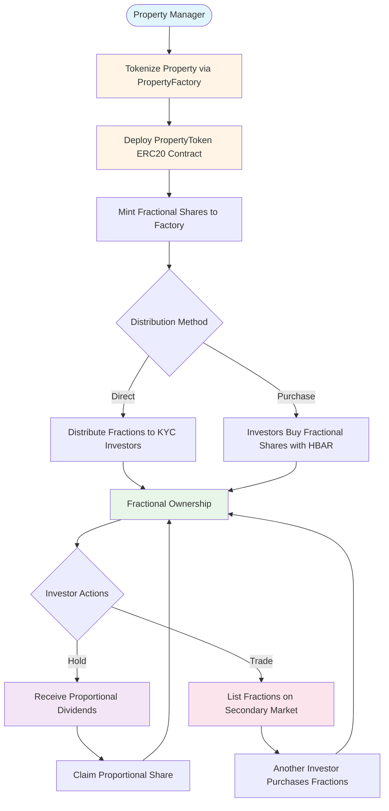
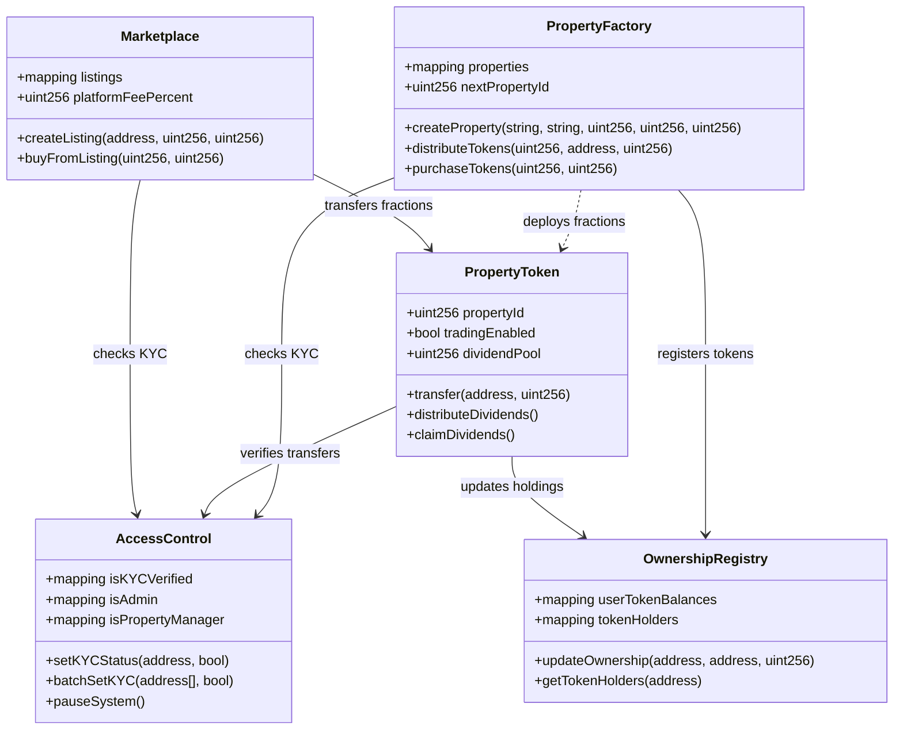

# Welcome Home
**The Trust Layer for Fractional Land & Real Estate Ownership in Africa**

Real Estate is the foundation of generational wealth — we're putting that foundation on-chain.

**GitHub Repository**: https://github.com/welcomehome-intl/welcome-marketplace

**Live Platform**: https://marketplace.welcomehomeinternationalgroup.com

---

## Table of Contents

- [Project Summary](#project-summary)
- [The Problem](#the-problem)
- [The Solution](#the-solution)
- [How Fractional Ownership Works](#how-fractional-ownership-works)
- [Platform Architecture](#platform-architecture)
- [MVP Features](#mvp-features)
- [Technology Stack](#technology-stack)
- [Repository Structure](#repository-structure)
- [Smart Contract Architecture](#smart-contract-architecture)
- [Getting Started](#getting-started)
- [Business Model](#business-model)
- [Market Opportunity](#market-opportunity)
- [Why Hedera](#why-hedera)
- [Long-Term Vision](#long-term-vision)
- [Development Workflow](#development-workflow)
- [Documentation](#documentation)

---

## Project Summary

Welcome Home is the blockchain-backed bridge between the African continent and its global diaspora, empowering individuals to invest in, co-own, and benefit from land-based assets through a secure, transparent, and decentralized platform. We are building the RWA (Real World Assets) rails for tokenized land, real estate, and infrastructure, starting with Senegal.

We solve three core problems:

**Access** – Diaspora investors face major barriers to land ownership in Africa due to opaque processes, informal systems, and lack of trust. Traditional real estate requires minimum investments of $50,000+, pricing out 99% of potential diaspora investors.

**Trust** – Fraud, misinformation, and historical land disputes prevent meaningful cross-border investment. Over 80% of African land remains undocumented or unverified, creating fertile ground for scams and fraudulent sales.

**Liquidity** – Real estate remains illiquid and inaccessible to most, especially in underdeveloped markets. Average time to sell property in Sub-Saharan Africa: 18-24 months with transaction costs of 10-15%.

Welcome Home offers a new paradigm: a decentralized land registry and marketplace that utilizes the Hedera network for speed, cost-efficiency, and verifiability, delivering secure access to fractional ownership of tokenized plots and revenue-generating real estate.

Our MVP introduces:

- **Fractional Property Tokens** as verifiable ERC20 representations of co-owned real-world parcels
- **KYC-enabled wallet onboarding** for legal clarity and investor compliance
- **Portfolio dashboard** for managing fractional investments, updates, and dividend distributions
- **Secondary marketplace** for peer-to-peer trading of fractional ownership
- **Transaction logs** anchored on Hedera for complete transparency

Welcome Home is building the trust layer for fractional land-based RWA investing in Africa, unlocking a multi-billion dollar opportunity and empowering a global community to reclaim legacy, wealth, and place.

---

## The Problem

Africans abroad send over $95 billion in remittances annually, yet less than 10% of that contributes to sustainable asset-building or land investment. This represents a staggering $85+ billion in missed wealth-building opportunities every single year.

Why is this happening?

**No verified land ownership systems** across most of the continent. 80%+ of African land is undocumented or unverified (World Bank Property Rights Index).

**No on-chain records of deeds or asset history**. Paper-based systems are vulnerable to corruption, loss, and fraud.

**No investment infrastructure for small-ticket entry**. Traditional real estate requires $50,000-$100,000 minimum investments, plus legal fees, physical presence, and 6-12 months of bureaucratic processing.

**No cross-border trust layer** to verify, hold, and govern land-based investments. Diaspora investors have no way to verify property ownership from abroad.

This results in:

- **Fraudulent land sales** where the same plot is sold to multiple buyers with no legal recourse
- **Lack of inheritance protection** due to missing documentation
- **Lack of access for first-time or small-scale investors** who can't meet traditional minimums
- **No liquidity pathways** for unlocking value once land is purchased
- **Diaspora disconnection** from ownership on the continent

We are solving for financial inclusion, asset legitimacy, and ownership accessibility through fractional tokenization.

---

## The Solution

Welcome Home is pioneering the first blockchain-powered fractional ownership platform for African land and real estate. We're unlocking verified, fractional co-ownership of land-based real world assets (RWAs) using Hedera's speed, transparency, and consensus.

Our platform is live on testnet and designed to allow anyone — from first-time diaspora investors to institutional developers — to securely buy, hold, and co-govern fractional shares of land and property assets in frontier markets like Senegal.

We're not just tokenizing land. We're building a global trust infrastructure for one of the most valuable and historically excluded asset classes on Earth.

### 1. Fractional Property Tokens (ERC20 Digital Shares)

Each property is represented by ERC20 tokens on Hedera, where 1 token = 1 fractional share of the underlying real estate.

**How it works:**
- Property managers tokenize real estate via our PropertyFactory contract
- Each property deploys its own ERC20 PropertyToken contract
- Total token supply represents 100% ownership of the physical property
- Investors purchase fractional shares starting at $100
- All ownership transfers recorded immutably on Hedera

**Why this matters:**
- **Democratized access**: Own 0.01% of a $1M property for just $100
- **Verifiable ownership**: Every share recorded on blockchain
- **No paper deeds**: Smart contracts replace corrupt intermediaries
- **Built-in inheritance**: Fractional shares transfer via wallet ownership

**Example:**
```
Dakar Sunset Villa: $500,000 property
Total Supply: 1,000,000 tokens
1 token = $0.50 of property value

Investor A buys 10,000 tokens ($5,000)
Ownership: 1% of property
Annual dividends: 1% of rental income
```

### 2. KYC-Compliant Fractional Investment Platform

Trust through verification. Our KYC system is integrated at the smart contract level:

**Multi-layer verification:**
- AccessControl contract manages all KYC status on-chain
- Every token transfer requires recipient KYC verification
- Batch processing for up to 100 users at once
- Admin controls for verification management

**Why this matters:**
- **Regulatory compliance** from day one
- **Protection against money laundering** and fraud
- **Institutional-grade security** for future partnerships
- **Investor confidence** through verified participants

### 3. Transparent Fractional Ownership Dashboard

Real-time portfolio management powered by blockchain data:

**Features:**
- Live fractional balance fetching from PropertyToken contracts
- Ownership percentage calculations per property
- Property value tracking in HBAR and USD
- Transaction history indexed for complete audit trail
- Auto-refresh every 10 seconds

**User experience:**
- Browse all available fractional investment opportunities
- One-click purchase of fractional shares with MetaMask
- Portfolio view showing all fractional holdings across properties
- Property detail pages with images, location, legal documents

### 4. Secondary Marketplace for Fractional Share Liquidity

The liquidity problem solved through peer-to-peer trading of fractional shares:

**Trading mechanisms:**
- Create sell listings for your fractional holdings
- Direct purchase from active listings
- Offer/counter-offer negotiation system
- Platform fee: 2.5% (96.5% lower than traditional real estate commissions)

**Why this matters:**
- **Exit your investment in minutes**, not months or years
- **Price discovery** through market dynamics
- **No 10-15% traditional transaction fees**
- **24/7 global marketplace** access

### 5. Automated Dividend Distribution to Fractional Owners

Transform fractional land ownership into passive income:

**How it works:**
- Property managers deposit rental income/revenue to PropertyToken contract
- Dividends tracked proportionally per fractional token holder
- Fractional owners claim at any time based on their ownership %
- All distributions logged on-chain for transparency

**Example calculation:**
```
Property: 1,000,000 tokens issued
Dividend Deposit: 10,000 HBAR in rental income

Fractional Owner A: 50,000 tokens (5%) = 500 HBAR
Fractional Owner B: 30,000 tokens (3%) = 300 HBAR
Fractional Owner C: 20,000 tokens (2%) = 200 HBAR
```

---

## How Fractional Ownership Works

Welcome Home uses ERC20 tokens to represent fractional ownership of real estate. Here's the complete flow:

### Property Tokenization Process

1. **Property Sourcing & Verification**
   - Local partners identify properties in Senegal, Ghana, Nigeria
   - Legal verification of ownership and title deeds
   - Property valuation by certified appraisers
   - Due diligence on legal status and encumbrances

2. **Smart Contract Deployment**
   - Property manager creates property via PropertyFactory
   - New PropertyToken (ERC20) contract deployed to Hedera
   - Total supply minted representing 100% ownership
   - Metadata stored on IPFS (images, legal docs, location)

3. **Fractional Share Distribution**
   - Tokens initially held by PropertyFactory contract
   - Property manager distributes to KYC-verified investors
   - Minimum investment: $100 (varies by property)
   - Maximum ownership per investor: configurable (e.g., 10%)

4. **Ongoing Management**
   - Property manager handles physical property management
   - Rental income collected and deposited to smart contract
   - Fractional owners claim dividends proportional to holdings
   - Annual reports and property updates via platform

### Investor Journey

**Step 1: Create Account & Complete KYC**
- Connect Hedera-compatible wallet (MetaMask, HashPack)
- Submit KYC documents for verification
- Verification typically completed within 24-48 hours

**Step 2: Browse Fractional Investment Opportunities**
- View all available properties on marketplace
- Filter by location, price, yield, property type
- Review property details, legal documents, images

**Step 3: Purchase Fractional Shares**
- Select desired number of tokens
- Review ownership percentage and estimated dividends
- Approve transaction with HBAR payment
- Tokens transferred immediately (3-second finality)

**Step 4: Manage Portfolio**
- View all fractional holdings in dashboard
- Track property values and ownership percentages
- Claim dividend distributions when available
- Vote on property decisions (governance)

**Step 5: Trade on Secondary Market**
- List fractional shares for sale at desired price
- Purchase additional shares from other investors
- Exit investment anytime with 24/7 liquidity

### Co-Ownership Governance

Fractional owners participate in property decisions:

**Voting Rights:**
- Voting power proportional to token holdings
- Vote on major property decisions (renovations, sale, etc.)
- Proposals require minimum quorum (e.g., 25% of tokens)
- On-chain voting via governance contracts

**Community Treasury:**
- Portion of rental income allocated to maintenance fund
- Fractional owners vote on treasury allocations
- Transparent tracking of all expenditures

---

## Platform Architecture

Welcome Home uses a hybrid blockchain and database architecture optimized for fractional ownership management:

### Blockchain Layer (Hedera) - Source of Truth

- **Fractional ownership records** via ERC20 tokens
- **Financial transactions** for purchases and dividends
- **Smart contract state** for all business logic
- **Token balances and transfers** immutably recorded
- **Complete audit trail** for regulatory compliance

### Database Layer (Supabase) - Performance Optimization

- **User profiles** and KYC metadata
- **Indexed transaction history** for fast queries
- **Real-time notifications** for dividend distributions
- **Property images** and documents
- **Portfolio analytics** and performance tracking

### Smart Contract System

The platform consists of five interconnected smart contracts deployed on Hedera Testnet, purpose-built for fractional ownership:

```
AccessControl (Central Authority)
    ├── OwnershipRegistry (Fractional Holder Tracking)
    ├── PropertyFactory (Property & Token Management)
    │   └── PropertyToken (ERC20 Fractional Shares)
    └── Marketplace (Secondary Trading of Fractions)
```

**Deployed Contracts (Hedera Testnet - Chain ID: 296):**

| Contract | Address | Purpose |
|----------|---------|---------|
| AccessControl | `0xDDAE60c136ea61552c1e6acF3c7Ab8beBd02eF69` | Authorization & KYC |
| OwnershipRegistry | `0x4Eb9F441eA43141572BC49a4e8Fdf53f44B5C99C` | Fractional holder tracking |
| PropertyFactory | `0x366e65Ca8645086478454c89C3616Ba0bAf15A35` | Property tokenization |
| Marketplace | `0x74347e6046819f6cbc64eb301746c7AaDA614Dec` | Secondary trading |

---

## MVP Features

Our MVP is currently live on Hedera Testnet, demonstrating complete end-to-end fractional ownership functionality:

### Smart Contract Features (Fully Deployed)

**Fractional Ownership Infrastructure**
- ERC20-compliant property tokens with 18 decimals
- Dynamic fractional token deployment via factory pattern
- Fractional share distribution to KYC-verified investors
- Direct fractional share purchase with HBAR payment
- KYC-gated transfers (all recipients must be verified)

**Revenue Distribution to Fractional Owners**
- Dividend distribution mechanism to PropertyToken contracts
- Proportional claiming based on fractional holdings
- Historical tracking of all dividend payments
- Automated calculations per token holder

**Secondary Market for Fractional Shares**
- Listing creation for fractional share sales
- Direct purchase from active listings
- Offer/counter-offer negotiation system
- Platform fee collection (2.5%)
- Complete audit trail via events

**Security & Compliance**
- Role-based access control (Owner > Admin > Property Manager)
- Emergency pause functionality across all contracts
- Reentrancy protection on all payable functions
- KYC verification system with batch processing
- Admin transfer override for crisis management

### Frontend Features (Production-Ready)

**Fractional Investment Marketplace**
- Browse all fractional investment opportunities
- Real-time data fetched from PropertyFactory contract
- Property detail pages with ownership distribution charts
- Token price calculator showing ownership percentages

**Fractional Share Purchase System**
- One-click purchase of fractional shares with HBAR
- Hedera-optimized transaction handling
- Real-time balance updates post-purchase
- Transaction feedback with loading states

**Fractional Ownership Portfolio Dashboard**
- View all fractional holdings across properties
- Ownership percentage calculations per property
- Property value tracking in HBAR
- "Buy More" functionality to increase fractional holdings
- Auto-refresh every 10 seconds

**Fractional Share Trading Interface**
- Create sell listings for fractional holdings
- Purchase fractional shares from other investors
- View active listings with price per token
- Offer/counter-offer negotiation

**Property Manager Admin Panel**
- Multi-step property tokenization form
- Image upload and metadata management
- PropertyFactory integration for deployment
- Token distribution interface for primary sales

**Wallet Integration**
- Web3 wallet connection via Wagmi
- Support for MetaMask, WalletConnect, HashPack
- Real-time connection status
- Network verification (Hedera Testnet)

---

## Technology Stack

### Smart Contracts (marketplace-contracts/)
- **Language**: Solidity ^0.8.19
- **Framework**: Foundry (Forge, Cast, Anvil)
- **Testing**: Comprehensive unit and integration tests
- **Network**: Hedera Testnet (Chain ID: 296)
- **Token Standard**: ERC20 for fractional ownership
- **Libraries**: OpenZeppelin Contracts (ERC20, Ownable, ReentrancyGuard)

### Frontend (marketplace-frontend/)
- **Framework**: Next.js 15.5.3 (App Router with Turbopack)
- **Language**: TypeScript for type safety
- **Web3**: Wagmi 2.x + Viem for blockchain interaction
- **Database**: Supabase (PostgreSQL with Row-Level Security)
- **Storage**: Supabase Storage + IPFS for decentralization
- **Styling**: Tailwind CSS + Shadcn UI components
- **State Management**: React hooks + TanStack Query

### Blockchain Network
- **Network**: Hedera Testnet / Mainnet
- **Testnet Chain ID**: 296
- **Mainnet Chain ID**: 295
- **Testnet RPC**: https://testnet.hashio.io/api
- **Mainnet RPC**: https://mainnet.hashio.io/api
- **Explorer**: https://hashscan.io
- **Native Currency**: HBAR
- **Block Time**: ~3 seconds (consensus time)

---

## Repository Structure

```
welcome-marketplace/
├── marketplace-contracts/          # Smart contracts (Solidity/Foundry)
│   ├── src/                       # Contract source files
│   │   ├── AccessControl.sol      # Role & KYC management
│   │   ├── OwnershipRegistry.sol  # Fractional holder tracking
│   │   ├── PropertyFactory.sol    # Property tokenization
│   │   ├── PropertyToken.sol      # ERC20 fractional shares
│   │   └── Marketplace.sol        # Secondary market trading
│   ├── test/                      # Comprehensive test suite
│   ├── script/                    # Deployment scripts
│   ├── ARCHITECTURE.md            # Detailed architecture diagrams
│   └── README.md                  # Contract documentation
│
├── marketplace-frontend/           # Frontend application (Next.js 15)
│   ├── app/                       # Next.js app router
│   │   ├── (dashboard)/           # Dashboard routes
│   │   ├── components/            # React components
│   │   └── lib/                   # Utilities and hooks
│   │       ├── web3/             # Blockchain hooks and ABIs
│   │       └── supabase/         # Database client
│   └── README.md                  # Frontend documentation
│
├── .gitignore                     # Combined gitignore
└── README.md                      # This file
```

---

## Smart Contract Architecture

### Complete Fractional Ownership Flow



### Contract Overview and Relationships



### Key Design Patterns for Fractional Ownership

**ERC20 Standard**: Each property token is a fully compliant ERC20 contract, enabling fractional ownership through standard token interfaces.

**Factory Pattern**: PropertyFactory dynamically deploys PropertyToken instances for each property, allowing unlimited scaling.

**KYC Gating**: All fractional share transfers require recipient verification at the smart contract level.

**Proportional Dividends**: Dividend distribution calculated automatically based on fractional token holdings.

**Secondary Market**: Marketplace contract enables peer-to-peer trading of fractional shares with platform fees.

For detailed architecture diagrams including property creation flow, token transfer validation, marketplace trading flow, and dividend distribution mechanisms, see `marketplace-contracts/ARCHITECTURE.md`.

---

## Getting Started

### Prerequisites

- Node.js 18+ and npm/pnpm
- Foundry (for smart contracts)
- Git
- Hedera Testnet account with HBAR
- MetaMask or compatible Web3 wallet

### Smart Contracts Setup

```bash
cd marketplace-contracts

# Install Foundry
curl -L https://foundry.paradigm.xyz | bash
foundryup

# Install dependencies
git submodule update --init --recursive

# Configure environment
cp .env.example .env
# Edit .env with your Hedera testnet private key

# Build contracts
forge build

# Run tests
forge test

# Deploy (see DEPLOYMENT_GUIDE.md)
./deploy_all.sh
```

### Frontend Setup

```bash
cd marketplace-frontend

# Install dependencies
npm install

# Configure environment
cp .env.example .env.local
# Edit .env.local with contract addresses and API keys

# Start development server
npm run dev
```

Visit http://localhost:3000

### Environment Variables

**Smart Contracts (.env)**:
```bash
HEDERA_RPC_URL=https://testnet.hashio.io/api
HEDERA_PRIVATE_KEY=0xYOUR_PRIVATE_KEY
HEDERA_CHAIN_ID=296
```

**Frontend (.env.local)**:
```bash
NEXT_PUBLIC_SUPABASE_URL=your_supabase_url
NEXT_PUBLIC_SUPABASE_ANON_KEY=your_anon_key

NEXT_PUBLIC_HEDERA_NETWORK=testnet
NEXT_PUBLIC_HEDERA_TESTNET_RPC_URL=https://testnet.hashio.io/api

ACCESS_CONTROL_ADDRESS=0xDDAE60c136ea61552c1e6acF3c7Ab8beBd02eF69
OWNERSHIP_REGISTRY_ADDRESS=0x4Eb9F441eA43141572BC49a4e8Fdf53f44B5C99C
PROPERTY_FACTORY_ADDRESS=0x366e65Ca8645086478454c89C3616Ba0bAf15A35
MARKETPLACE_ADDRESS=0x74347e6046819f6cbc64eb301746c7AaDA614Dec
```

---

## Business Model

Welcome Home's revenue model is built on fractional ownership transactions and management:

### B2C - Diaspora & Local Investors

**Transaction Fees**: 1.5% on all fractional share purchases
- Applied when investors buy fractional tokens
- 96.5% lower than traditional real estate fees

**Management Fees**: 1.5-2% annually on assets under management
- Services: Property management, dividend distribution, legal compliance
- Calculated on total property value, not individual holdings

**Secondary Market Commission**: 2.5% on seller proceeds
- Applied when fractional shares trade peer-to-peer
- Split: 2.0% platform, 0.5% liquidity pool

### B2B - Government & Developer Partnerships

**Custom Registry Deployment**: $50K - $200K per implementation
- White-label fractional ownership platforms
- Government land registries
- Developer tokenization systems

**Data Licensing**: $10K - $50K annually
- On-chain property history and analytics
- Fractional ownership data for market research

**Developer Listing Fees**: 0.5% of property sale value
- Property developers tokenizing new developments
- Revenue share on primary sales

---

## Market Opportunity

### Total Addressable Market (TAM): $1.5 Trillion

**African Real Estate Market (McKinsey 2030)**
- Current market size: $1.2 trillion
- Projected 2030: $1.5 trillion
- Annual growth rate: 7.5% CAGR
- Urbanization driver: 500M Africans moving to cities by 2030

**Diaspora Remittances: $95B annually**
- Growing at 5.2% annually (World Bank)
- 45% interested in asset-building vs. consumption (AfDB)
- Potential investment flow: $42.75B annually

### Serviceable Addressable Market (SAM): $427.5M Annually

**Target Segment:**
- 45 million diaspora members interested in land/real estate investment (AfDB, 2023)
- Average desired annual investment: $500 - $2,000
- Our serviceable segment (English-speaking Africa): $10.69B
- Initial target markets (Senegal, Ghana, Nigeria, Kenya): $4.27B

### Serviceable Obtainable Market (SOM): First 3 Years

**Conservative 3-Year Targets:**

| Year | Active Users | Avg Investment | Transaction Volume |
|------|-------------|---------------|-------------------|
| Year 1 | 2,500 | $950 | $2.375M |
| Year 2 | 10,000 | $1,200 | $12M |
| Year 3 | 20,000 | $1,350 | $27M |

**Year 3 Totals:**
- Primary market volume: $27M
- Secondary market volume: $5M (20% of primary)
- Total transaction volume: $32M
- Market penetration: 7.5% of SAM
- Represents 0.044% of total diaspora investors

### Market Drivers

**Demographic**: 300M Africans in global diaspora, median age 32, high digital literacy

**Economic**: African GDP growth 3.8% annually, 130M new middle-class Africans by 2030

**Technological**: 495M smartphone users by 2025, 548M mobile money accounts

**Regulatory**: AU Digital Transformation Strategy, blockchain land registry pilots

---

## Why Hedera

Welcome Home selected Hedera because fractional ownership at scale requires low fees, high speed, and absolute finality:

### Cost-Efficiency: Making Micro-Ownership Economically Viable

**The Math:**
- Average fractional investment: $100
- Traditional blockchain fees: $5-50 per transaction
- Result: 5-50% fees make fractional investments impossible

**Hedera Solution:**
- Average transaction cost: $0.001 - $0.01
- 99.98% cost reduction vs. Ethereum
- $100 investment remains $100 in property value

### Speed: Real-Time Fractional Ownership Updates

- 3-second finality vs. 15+ minutes on other chains
- 10,000+ TPS capacity
- Instant portfolio updates for fractional owners

### Finality: No Risk of Ownership Reversal

**aBFT Consensus:**
- Absolute finality within 3 seconds
- Mathematically impossible to reverse
- No chain reorganizations, ever

**Critical for fractional ownership:** Investors cannot risk their fractional shares being reversed after purchase.

### Regulatory Compliance: Building for Institutional Adoption

- Governed by 32 global organizations (Google, IBM, Boeing)
- No single point of failure or control
- Built for enterprise partnerships

### Environmental Responsibility

- Carbon-negative network
- 0.00017 kWh per transaction
- Aligns with ESG mandates for institutional investors

---

## Long-Term Vision

Welcome Home is more than fractional ownership — it's about rebuilding legacy and wealth through trust.

### Short-Term Goals (12 Months)
- Tokenize 50+ parcels across Senegal, Ghana, Nigeria
- Onboard 2,500 fractional co-owners
- Launch on-chain marketplace and governance
- Establish partnerships with local land authorities

### Medium-Term Goals (2-3 Years)
- Expand to 5 African markets
- Reach $20M in tokenized land sales
- Launch DAO governance for fractional owner decisions
- Develop mobile applications for wider accessibility

### Long-Term Vision (5+ Years)
- Build a decentralized global land registry
- Onboard 1M fractional co-owners
- Tokenize $100M+ in African land and real estate
- Launch RWA infrastructure grants for local builders
- Enable on-chain inheritance, resale, and governance across multiple countries
- Establish Welcome Home as the standard for African RWA fractional ownership

---

## Development Workflow

### Making Changes to Smart Contracts

1. Edit in `marketplace-contracts/src/`
2. Write/update tests in `marketplace-contracts/test/`
3. Run tests: `forge test`
4. Deploy to testnet following `DEPLOYMENT_GUIDE.md`
5. Update contract addresses in `marketplace-frontend/.env.local`
6. Update ABIs in `marketplace-frontend/app/lib/web3/abis/`
7. Test integration with frontend

### Making Changes to Frontend

1. Edit in `marketplace-frontend/app/`
2. Test locally: `npm run dev`
3. Build for production: `npm run build`
4. Deploy to Vercel or hosting platform

---

## Documentation

### Smart Contracts
- `marketplace-contracts/README.md` - Contract overview and features
- `marketplace-contracts/ARCHITECTURE.md` - Detailed architecture diagrams
- `marketplace-contracts/DEPLOYMENT_GUIDE.md` - Step-by-step deployment
- `marketplace-contracts/FRONTEND_INTEGRATION.md` - Integration guide

### Frontend
- `marketplace-frontend/README.md` - Frontend overview and roadmap
- `marketplace-frontend/INTEGRATION_README.md` - Comprehensive integration docs
- `marketplace-frontend/SUPABASE_SETUP.md` - Database configuration

---

## Contributing

Welcome Home is currently in active development for the Hedera Hack Africa hackathon. We welcome feedback and contributions from the community.

---

## License

See individual LICENSE files in `marketplace-contracts/` and `marketplace-frontend/` directories.

---

## Support & Contact

For issues, questions, or partnerships:
- GitHub Issues: https://github.com/welcomehome-intl/welcome-marketplace/issues
- Website: https://welcomehomeinternationalgroup.com
- Email: support@welcomehomeintl.com

---

## Links & Resources

- **Hedera Documentation**: https://docs.hedera.com
- **Foundry Book**: https://book.getfoundry.sh
- **Next.js Documentation**: https://nextjs.org/docs
- **Wagmi Documentation**: https://wagmi.sh
- **HashScan Explorer**: https://hashscan.io

---

Built with purpose for the African diaspora by Welcome Home International Group

Empowering fractional ownership. Building legacy. Restoring trust.
