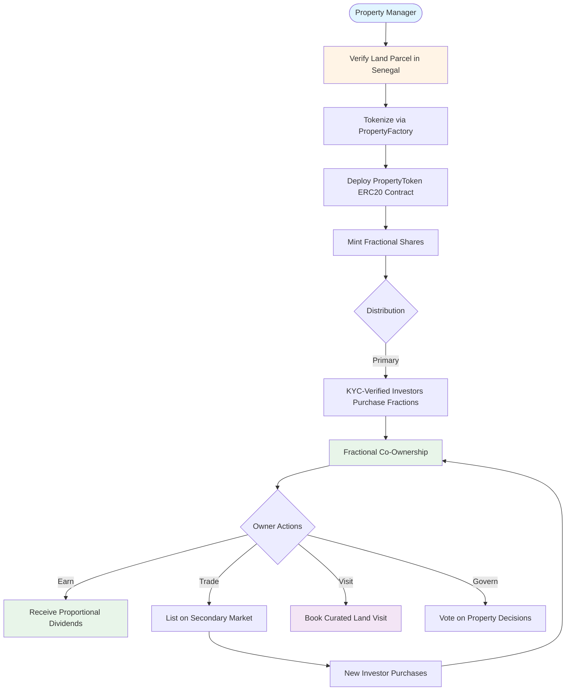
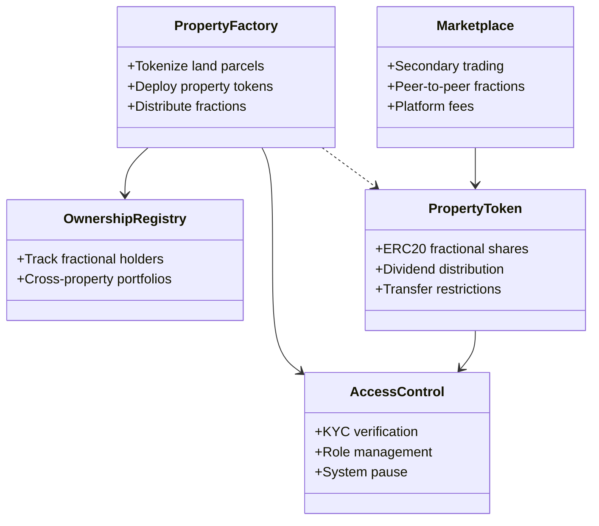

# Welcome Home: Real Estate, Reconnection, Reimagined

**Track**: RWA / Tokenization / DeFi
**Stage**: MVP (on testnet)
**Protocol**: Hedera

**GitHub Repository**: https://github.com/welcomehome-intl/welcome-marketplace
**Live Platform**: https://marketplace.welcomehomeinternationalgroup.com

---

## Overview

Welcome Home is a real estate platform redefining ownership across the African continent. By leveraging blockchain, we enable individuals across the global Diaspora to co-own verified land in Africa—starting in Senegal—with accessible entry points. Each digital asset is rooted in transparency, cultural reconnection, and long-term economic empowerment.

Our platform turns land into accessible, tokenized assets—bridging cultural and capital gaps through trust, technology, and travel.

We're building infrastructure for belonging, ownership, and return—one smart contract at a time.

---

## Problem

Africa holds the majority of the world's arable land, yet most individuals across the global Diaspora lack pathways to own, access, or co-develop it. Current systems are fractured by:

- **Legal opacity and decentralized land registries** – Over 80% of African land remains undocumented or unverified (World Bank)
- **High capital barriers and risk of fraud** – Traditional real estate requires $50,000+ minimums, pricing out 99% of potential investors
- **Lack of verification mechanisms across jurisdictions** – No way to verify ownership from abroad
- **Absence of accessible digital tools for international co-ownership** – Paper-based systems vulnerable to corruption and loss
- **Disconnection from real-world opportunities in real estate** – No infrastructure to physically engage with owned land

Meanwhile, over $95 billion in remittances flow into Africa every year—but few mechanisms exist to transform that liquidity into collective asset ownership.

The result? The demand is global, but the infrastructure has not been accessible. Until now.

---

## Solution

Welcome Home unlocks land ownership through blockchain-powered, culturally anchored co-investment. Our platform enables:

- **Land sourcing & legal verification on the ground** – Local partnerships in Senegal for property verification and title deed validation
- **Tokenization of land into fractionalized real estate assets** – Each property represented by ERC20 tokens on Hedera, where 1 token = 1 fractional share
- **Proof of ownership minted on Hedera Token Service (HTS)** – Immutable ownership records replacing corrupt intermediaries
- **Transparent smart contracts tied to governance and payouts** – Proportional dividend distribution and voting rights based on holdings
- **Curated travel experiences for members to engage with the land they own** – Real-world visits and homecoming experiences for co-owners
- **A digital dashboard and wallet interface for easy onboarding** – KYC-compliant platform accessible to first-time blockchain users

We transform property into possibility—allowing members of the Diaspora to both invest in and physically visit the land they co-own.

### How Fractional Ownership Works

**Property Tokenization**
- Local partners verify land parcels in Senegal through legal due diligence
- Properties tokenized via PropertyFactory smart contract on Hedera
- Each property deploys its own ERC20 token contract representing fractional shares
- Total token supply = 100% ownership of the physical land

**Investor Journey**
1. Connect wallet and complete KYC verification
2. Browse available land parcels with verified legal status
3. Purchase fractional shares starting at accessible entry points
4. Receive ERC20 tokens representing co-ownership percentage
5. Earn proportional dividends from land development or rental income
6. Participate in governance decisions for property management
7. Trade fractional shares on secondary marketplace for liquidity
8. Book curated travel experiences to visit the land you co-own

**Example:**
```
Dakar Land Parcel: 5,000 sqm plot
Total Supply: 1,000,000 tokens
Investment: Accessible fractional ownership

Co-owner A: 10,000 tokens = 1% ownership
Annual dividends: 1% of development income
Governance: 1% voting power on property decisions
Travel: Curated visit to engage with land IRL
```

---

## Why Hedera

Welcome Home selected Hedera for its performance, governance, and stability. Specific benefits include:

- **HTS for minting fractional land-backed tokens** – Native token service optimized for asset tokenization
- **HCS for on-chain transaction and ownership verification** – Immutable audit trail for regulatory compliance
- **Mirror nodes for data syncing and transparency** – Real-time access to ownership records
- **Low, fixed gas fees that support micro-ownership models** – $0.001 average transaction cost vs. $5-50 on other chains
- **Native support for identity and KYC solutions** – Built-in compliance infrastructure
- **Sustainable energy profile aligned with our values** – Carbon-negative network for ESG alignment

As we build infrastructure that must work across countries, governments, and user tiers, Hedera offers the scalable trust layer we require.

---

## What We Built (MVP)

Deployed on Hedera testnet, our MVP includes:

### Smart Contract Infrastructure

**Fractional Ownership Engine**
- AccessControl: Role-based permissions and KYC verification system
- OwnershipRegistry: Cross-property fractional holder tracking
- PropertyFactory: Property tokenization and deployment system
- PropertyToken: ERC20 contracts for fractional land shares
- Marketplace: Peer-to-peer secondary trading platform

**Deployed Contracts (Hedera Testnet - Chain ID: 296)**

| Contract | Address | Purpose |
|----------|---------|---------|
| AccessControl | `0xDDAE60c136ea61552c1e6acF3c7Ab8beBd02eF69` | Authorization & KYC |
| OwnershipRegistry | `0x4Eb9F441eA43141572BC49a4e8Fdf53f44B5C99C` | Fractional holder tracking |
| PropertyFactory | `0x366e65Ca8645086478454c89C3616Ba0bAf15A35` | Property tokenization |
| Marketplace | `0x74347e6046819f6cbc64eb301746c7AaDA614Dec` | Secondary trading |

### Platform Features

- **Secure tokenization engine for registered land in Senegal**
- **Smart contract architecture for ownership & governance**
- **Hedera-based fractional token system**
- **Admin dashboard for listings, compliance, and wallet access**
- **KYC/AML protocol integrations** (beta)
- **Waitlist and onboarding experience for new members**
- **Travel integration prototype for co-owners to visit land IRL**

This MVP was designed to test flow, compliance, usability, and future DeFi integration.

---

## What Makes Us Different

Welcome Home is not just a digital real estate platform. We are building a movement—a lifestyle brand grounded in land, legacy, and belonging.

What sets us apart:

**End-to-end ownership flow**: From legal verification to tokenization to travel, we provide the full lifecycle of land ownership. Not just tokens—real land you can visit.

**Cultural reconnection**: Every property comes with place-based storytelling and member experiences. We're rebuilding connection between the Diaspora and the continent through land ownership.

**Accessible entry**: Starting at accessible minimums with USD and crypto on-ramps. No $50,000 barriers—fractional ownership for everyone.

**Regenerative approach**: Land parcels prioritized for sustainable development and community benefit. We're not just extracting value—we're building legacy.

**Real estate meets hospitality**: We offer curated visits and homecoming experiences. Own the land, walk the land, develop the land.

While others focus only on yield or protocol efficiency, we focus on people, place, and purpose—while still building a tech-forward, compliance-ready asset model.

---

## Target Market

- **250M+ members of the global African Diaspora** – Primary target for fractional land ownership
- **3M+ annual travelers to the continent (and growing)** – Growing homecoming tourism sector
- **$1.2T projected African real estate market** – Massive opportunity with minimal blockchain penetration
- **<1% tokenized land infrastructure across the continent** – First-mover advantage in fractional ownership

Welcome Home sits at the intersection of tokenized assets, heritage travel, and Diaspora investment.

### Market Drivers

**$95B in annual remittances** – Liquidity exists, but no infrastructure to convert into collective asset ownership

**Legal opacity** – 80%+ of land undocumented, creating demand for blockchain-based verification

**Cultural reconnection** – Growing movement of Diaspora members seeking tangible ties to the continent

**Urbanization** – 500M Africans moving to cities by 2030, driving land value appreciation

---

## Roadmap

### Q3 2025
- Mainnet deployment on Hedera
- Launch of land dashboard with token escrow
- Beta travel experience rollout in Senegal
- Government partnerships for land verification

### Q4 2025
- Integration with USDC on/off ramp for accessible entry
- Expansion to Ghana and Kenya
- Launch of Welcome Home "Passport" membership layer
- Mobile app beta for digital land access

### 2026 and Beyond
- 10,000+ members onboarded as fractional co-owners
- $100M in land assets tokenized across 5+ countries
- Native mobile app for portfolio management and travel booking
- DAO-lite governance layer for pooled investments
- Establish Welcome Home as the standard for African land ownership

---

## Why We'll Win

**Proven founding team** with track records in real estate, blockchain, strategy, and storytelling. We combine domain expertise with technical execution.

**Strong market traction**: Government engagement in Senegal, pilot properties secured, 500+ early waitlist signups before mainnet launch.

**Real utility**: Not theoretical—verified land, physical access, and legal ownership. We're not selling tokens, we're selling land.

**Brand trust and design**: Already active in community events, partnerships, and IRL activations. We're building a movement, not just a protocol.

**Fully aligned with Hedera's mission**: Infrastructure that works at scale, for real people, across the globe. We're proving RWAs work.

**Cultural authenticity**: Led by Diaspora members who understand the emotional, cultural, and financial importance of land ownership. This is personal.

Welcome Home isn't just a tech company. We are building infrastructure for belonging, ownership, and return—one smart contract at a time.

---

## Technology Stack

### Smart Contracts
- **Language**: Solidity ^0.8.19
- **Framework**: Foundry (Forge, Cast, Anvil)
- **Network**: Hedera Testnet (Chain ID: 296)
- **Token Standard**: ERC20 for fractional ownership
- **Libraries**: OpenZeppelin Contracts

### Frontend
- **Framework**: Next.js 15.5.3 (App Router)
- **Language**: TypeScript
- **Web3**: Wagmi 2.x + Viem
- **Database**: Supabase (PostgreSQL)
- **Styling**: Tailwind CSS + Shadcn UI

### Blockchain Network
- **Testnet Chain ID**: 296
- **Mainnet Chain ID**: 295
- **RPC**: https://testnet.hashio.io/api
- **Explorer**: https://hashscan.io/testnet
- **Native Currency**: HBAR
- **Block Time**: ~3 seconds

---

## Repository Structure

```
welcome-marketplace/
├── marketplace-contracts/          # Smart contracts (Solidity/Foundry)
│   ├── src/                       # Contract source files
│   │   ├── AccessControl.sol      # Role & KYC management
│   │   ├── OwnershipRegistry.sol  # Fractional holder tracking
│   │   ├── PropertyFactory.sol    # Property tokenization
│   │   ├── PropertyToken.sol      # ERC20 fractional shares
│   │   └── Marketplace.sol        # Secondary market trading
│   ├── test/                      # Comprehensive test suite
│   ├── script/                    # Deployment scripts
│   └── README.md                  # Contract documentation
│
├── marketplace-frontend/           # Frontend application (Next.js 15)
│   ├── app/                       # Next.js app router
│   │   ├── (dashboard)/           # Dashboard routes
│   │   ├── components/            # React components
│   │   └── lib/                   # Web3 hooks and utilities
│   └── README.md                  # Frontend documentation
│
└── README.md                      # This file
```

---

## Architecture Overview

### Fractional Ownership Flow



### Smart Contract System



---

## Getting Started

### For Investors

1. Visit https://marketplace.welcomehomeinternationalgroup.com
2. Connect your Hedera-compatible wallet (MetaMask, HashPack)
3. Complete KYC verification
4. Browse available land parcels in Senegal
5. Purchase fractional shares with HBAR
6. Manage your portfolio and claim dividends
7. Book travel experiences to visit your land

### For Developers

**Smart Contracts:**
```bash
cd marketplace-contracts
git submodule update --init --recursive
forge build
forge test
```

**Frontend:**
```bash
cd marketplace-frontend
npm install
npm run dev
```

See `/marketplace-contracts/README.md` and `/marketplace-frontend/README.md` for detailed setup instructions.

---

## Documentation

- `marketplace-contracts/README.md` - Smart contract overview
- `marketplace-contracts/ARCHITECTURE.md` - Detailed technical diagrams
- `marketplace-contracts/DEPLOYMENT_GUIDE.md` - Deployment instructions
- `marketplace-frontend/README.md` - Frontend documentation
- `marketplace-frontend/CLAUDE.md` - Development guidance

---

## Support & Contact

**GitHub**: https://github.com/welcomehome-intl/welcome-marketplace
**Website**: https://welcomehomeinternationalgroup.com
**Email**: support@welcomehomeintl.com

---

## Links & Resources

- **Hedera Documentation**: https://docs.hedera.com
- **HashScan Explorer**: https://hashscan.io/testnet
- **Foundry Book**: https://book.getfoundry.sh
- **Next.js Documentation**: https://nextjs.org/docs

---

Built with purpose for the African diaspora by Welcome Home International Group

**Empowering fractional ownership. Building legacy. Restoring trust.**
