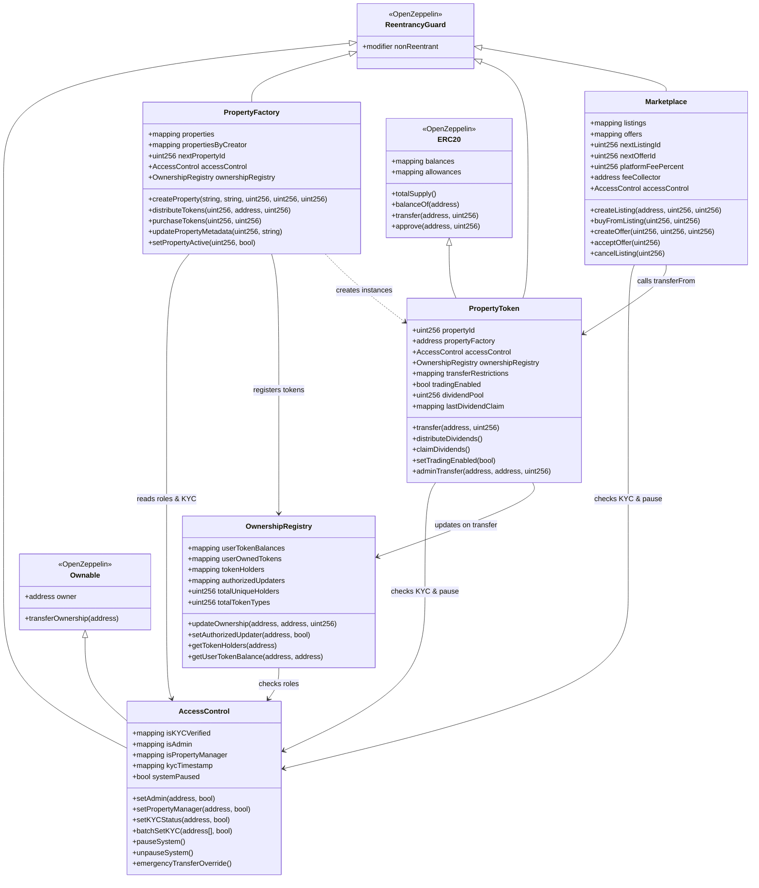
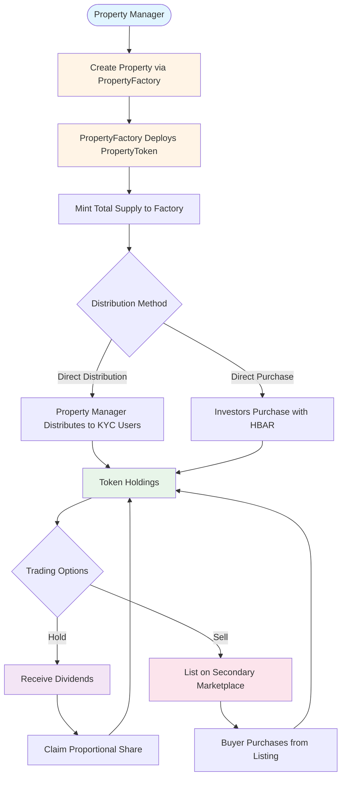

# Welcome Home - Blockchain-Powered Real Estate Tokenization for Africa

Building the trust layer for land-based Real World Asset (RWA) investing in Africa, unlocking a multi-billion dollar opportunity and empowering a global community to reclaim legacy, wealth, and place.

**GitHub Repository**: https://github.com/welcomehome-intl/welcome-marketplace

**Live Application**: https://marketplace.welcomehomeinternationalgroup.com

---

## Table of Contents

- [Project Summary](#project-summary)
- [The Problem](#the-problem)
- [The Solution](#the-solution)
- [Platform Architecture](#platform-architecture)
- [MVP Features](#mvp-features)
- [Technology Stack](#technology-stack)
- [Repository Structure](#repository-structure)
- [Smart Contract Architecture](#smart-contract-architecture)
- [Getting Started](#getting-started)
- [Business Model](#business-model)
- [Market Opportunity](#market-opportunity)
- [Why Hedera](#why-hedera)
- [Long-Term Vision](#long-term-vision)
- [Development Workflow](#development-workflow)
- [Documentation](#documentation)
- [License](#license)

---

## Project Summary

Welcome Home is the blockchain-backed bridge between the African continent and its global diaspora, empowering individuals to invest in, co-own, and benefit from land-based assets through a secure, transparent, and decentralized platform. We are building the RWA (Real World Assets) rails for tokenized land, real estate, and infrastructure, starting with Senegal.

We solve three core problems:

**Access** – Diaspora investors face major barriers to land ownership in Africa due to opaque processes, informal systems, and lack of trust.

**Trust** – Fraud, misinformation, and historical land disputes prevent meaningful cross-border investment.

**Liquidity** – Real estate remains illiquid and inaccessible to most, especially in underdeveloped markets.

Welcome Home offers a new paradigm: a decentralized land registry and marketplace that utilizes the Hedera network for speed, cost-efficiency, and verifiability, delivering secure access to tokenized plots and revenue-generating real estate.

---

## The Problem

Africans abroad send over $95B in remittances annually, yet less than 10% of that contributes to sustainable asset-building or land investment. Why?

- No verified land ownership systems across most of the continent
- No on-chain records of deeds or asset history
- No investment infrastructure for small-ticket entry
- No cross-border trust layer to verify, hold, and govern land-based investments

This results in:

- Fraudulent land sales and lack of inheritance protection
- Lack of access for first-time or small-scale investors
- No liquidity pathways for unlocking value once land is purchased
- Diaspora disconnection from ownership on the continent

We are solving for financial inclusion, asset legitimacy, and ownership accessibility.

---

## The Solution

Welcome Home's platform offers a modular RWA tokenization stack for African land and real estate investments:

### 1. Land NFTs (Digital Deeds)
- Each land parcel is minted as a unique token on the Hedera Token Service (HTS)
- Smart contracts manage co-ownership, proof of deed, and distribution rights
- Tokens are embedded with metadata from verified land title documents

### 2. KYC/AML Onboarding for Diaspora Investors
- Built-in KYC flow ensures only compliant users can mint or purchase assets
- Compliance is managed through smart contract-based verification
- Wallet-based authentication system

### 3. Transparent Investment Dashboard
- Real-time ownership visibility for each token holder
- Transaction logs, legal documents, and status of each asset
- Portfolio management with ownership percentages and value tracking

### 4. Secondary Marketplace
- Peer-to-peer trading of property tokens
- Direct purchase and offer/counter-offer mechanisms
- Platform fee structure (2.5% default)
- Complete KYC-gated participation

### 5. Dividend Distribution System
- Automated dividend distribution to token holders
- Proportional distribution based on token ownership
- Claim mechanism for investors
- Historical tracking and transparency

---

## Platform Architecture

Welcome Home uses a hybrid blockchain and database architecture for optimal performance and transparency:

### Blockchain Layer (Hedera) - Source of Truth
- Ownership records
- Financial transactions
- Smart contract state
- Token balances and transfers
- Immutable audit trail

### Database Layer (Supabase) - Performance Optimization
- User profiles and metadata
- Indexed transaction history
- Real-time notifications
- Query optimization for UI
- Image and document storage

### Smart Contract System

The platform consists of five interconnected smart contracts deployed on Hedera Testnet:

```
AccessControl (Central Authority)
    ├── OwnershipRegistry (Token Holder Tracking)
    ├── PropertyFactory (Property & Token Management)
    │   └── PropertyToken (ERC20 with Extensions)
    └── Marketplace (Secondary Trading)
```

**Deployed Contracts (Hedera Testnet)**:

| Contract | Address | Purpose |
|----------|---------|---------|
| AccessControl | `0xDDAE60c136ea61552c1e6acF3c7Ab8beBd02eF69` | Authorization & KYC |
| OwnershipRegistry | `0x4Eb9F441eA43141572BC49a4e8Fdf53f44B5C99C` | Token holder tracking |
| PropertyFactory | `0x366e65Ca8645086478454c89C3616Ba0bAf15A35` | Property creation |
| Marketplace | `0x74347e6046819f6cbc64eb301746c7AaDA614Dec` | Secondary trading |

---

## MVP Features

Our MVP is currently live on Hedera Testnet and includes:

### Smart Contract Features (Fully Deployed)

**Core Infrastructure**
- Role-based access control (Owner > Admin > Property Manager)
- KYC verification system with batch processing
- Emergency pause functionality for crisis management
- Cross-contract ownership tracking and analytics

**Property Management**
- Dynamic property token deployment via factory pattern
- Primary token distribution to KYC-verified investors
- Direct token purchase with HBAR payment
- Property metadata management with IPFS integration
- Price and status management per property

**Token Operations**
- ERC20-compliant property tokens with 18 decimals
- KYC-gated transfers (all recipients must be verified)
- Dividend distribution and claiming mechanism
- Trading enable/disable controls per property
- Transfer restrictions for compliance

**Secondary Marketplace**
- Listing creation with customizable pricing
- Direct purchase from listings
- Offer/counter-offer negotiation system
- Platform fee collection (2.5% default)
- Complete audit trail via events

**Security Features**
- Reentrancy protection on all payable functions
- System-wide pause capability
- Admin transfer override for emergencies
- Comprehensive event logging for transparency

### Frontend Features (Next.js Application)

**Property Marketplace**
- Browse all available properties with real-time blockchain data
- View detailed property information (images, location, specifications)
- Property cards displaying token price, total supply, and availability
- Real-time property data fetched from PropertyFactory contract

**Token Purchase System**
- Direct token purchase with HBAR payment
- Hedera-optimized transaction handling (tinybar conversion)
- Transaction feedback with loading states and confirmation
- Real-time balance updates post-purchase
- KYC verification integration

**Portfolio Management**
- Dedicated portfolio page displaying owned properties
- Real-time token balance fetching from PropertyToken contracts
- Ownership percentage calculations
- Property value tracking in HBAR
- "Buy More" functionality for additional purchases
- Auto-refresh every 10 seconds

**Property Creation (Admin)**
- Multi-step property creation form
- Image upload to Supabase Storage
- Metadata management with IPFS URIs
- PropertyFactory integration for on-chain deployment
- Property details (bedrooms, bathrooms, year built, etc.)
- Location and amenity selection

**Wallet Integration**
- Web3 wallet connection via wagmi
- Support for MetaMask, WalletConnect, and other EVM wallets
- Real-time connection status
- Address display and management

**User Interface**
- Modern, responsive design with Tailwind CSS
- Mobile-optimized layouts
- Loading states and error handling
- Interactive property cards
- Dashboard with navigation

---

## Technology Stack

### Smart Contracts (marketplace-contracts/)
- **Language**: Solidity ^0.8.19
- **Framework**: Foundry (Forge, Cast, Anvil)
- **Testing**: Comprehensive unit and integration tests
- **Network**: Hedera Testnet (Chain ID: 296)
- **Libraries**: OpenZeppelin Contracts (ERC20, Ownable, ReentrancyGuard)

### Frontend (marketplace-frontend/)
- **Framework**: Next.js 15.5.3 (App Router with Turbopack)
- **Language**: TypeScript
- **Web3**: Wagmi 2.x + Viem
- **Database**: Supabase (PostgreSQL with Row-Level Security)
- **Storage**: Supabase Storage + IPFS
- **Styling**: Tailwind CSS + Shadcn UI components
- **State Management**: React hooks + TanStack Query

### Blockchain Network
- **Network**: Hedera Testnet / Mainnet
- **Testnet Chain ID**: 296
- **Mainnet Chain ID**: 295
- **Testnet RPC**: https://testnet.hashio.io/api
- **Mainnet RPC**: https://mainnet.hashio.io/api
- **Explorer**: https://hashscan.io
- **Native Currency**: HBAR
- **Block Time**: ~3 seconds (consensus time)

---

## Repository Structure

```
welcome-marketplace/
├── marketplace-contracts/          # Smart contracts (Solidity/Foundry)
│   ├── src/                       # Contract source files
│   │   ├── AccessControl.sol      # Role & KYC management
│   │   ├── OwnershipRegistry.sol  # Token holder tracking
│   │   ├── PropertyFactory.sol    # Property creation & management
│   │   ├── PropertyToken.sol      # ERC20 property tokens with dividends
│   │   └── Marketplace.sol        # Trading platform with fees
│   ├── test/                      # Comprehensive test suite
│   ├── script/                    # Deployment scripts (atomic transactions)
│   ├── ARCHITECTURE.md            # Detailed architecture diagrams
│   ├── DEPLOYMENT_GUIDE.md        # Step-by-step deployment instructions
│   ├── FRONTEND_INTEGRATION.md    # Integration guide for frontend
│   └── README.md                  # Contract documentation
│
├── marketplace-frontend/           # Frontend application (Next.js 15)
│   ├── app/                       # Next.js app router
│   │   ├── (dashboard)/           # Dashboard routes
│   │   ├── components/            # React components
│   │   │   ├── admin/            # Admin-specific components
│   │   │   ├── marketplace/      # Marketplace components
│   │   │   ├── property/         # Property components
│   │   │   ├── ui/               # Shadcn UI components
│   │   │   └── web3/             # Web3 integration
│   │   └── lib/                   # Utilities and hooks
│   │       ├── web3/             # Blockchain hooks and ABIs
│   │       └── supabase/         # Database client and hooks
│   ├── public/                    # Static assets
│   ├── INTEGRATION_README.md      # Comprehensive integration docs
│   └── README.md                  # Frontend documentation
│
├── .gitignore                     # Combined gitignore for both projects
└── README.md                      # This file
```

---

## Smart Contract Architecture

### Contract Overview and Relationships

The following diagram shows the complete smart contract architecture with all relationships:



### Complete System Flow

The following diagram illustrates the entire lifecycle from property creation through dividend distribution:



### Contract Interaction Flow

For additional detailed architecture diagrams including:
- Property creation and distribution sequence
- Token transfer validation flow
- Marketplace trading flow
- Access control and authorization
- Dividend distribution mechanism

See `marketplace-contracts/ARCHITECTURE.md` for comprehensive Mermaid diagrams.

### Key Design Patterns

**Modular Architecture**: Five specialized contracts with clear separation of concerns

**Factory Pattern**: PropertyFactory dynamically deploys PropertyToken instances

**Authorized Updater Pattern**: OwnershipRegistry only accepts updates from verified contracts

**Role-Based Access Control**: Three-tier hierarchy (Owner > Admin > Property Manager)

**KYC Gating**: All token transfers require recipient verification

**Emergency Controls**: System-wide pause and admin override capabilities

**Event-Driven**: Comprehensive event emissions for off-chain indexing and frontend updates

---

## Getting Started

### Prerequisites

- Node.js 18+ and npm/pnpm
- Foundry (for smart contracts)
- Git
- Hedera Testnet account with HBAR
- MetaMask or compatible Web3 wallet

### Smart Contracts Setup

```bash
cd marketplace-contracts

# Install Foundry if not already installed
curl -L https://foundry.paradigm.xyz | bash
foundryup

# Install dependencies
git submodule update --init --recursive

# Configure environment
cp .env.example .env
# Edit .env with your Hedera testnet private key

# Build contracts
forge build

# Run tests
forge test

# Run tests with verbosity
forge test -vvv

# Generate gas report
forge test --gas-report

# Deploy contracts (see marketplace-contracts/DEPLOYMENT_GUIDE.md)
./deploy_all.sh
```

### Frontend Setup

```bash
cd marketplace-frontend

# Install dependencies
npm install
# or
pnpm install

# Configure environment
cp .env.example .env.local
# Edit .env.local with contract addresses and API keys

# Start development server
npm run dev
# or
pnpm dev

# Build for production
npm run build

# Start production server
npm start
```

Visit http://localhost:3000

### Environment Variables

**Smart Contracts (.env)**:
```bash
HEDERA_RPC_URL=https://testnet.hashio.io/api
HEDERA_PRIVATE_KEY=0xYOUR_PRIVATE_KEY
HEDERA_CHAIN_ID=296
```

**Frontend (.env.local)**:
```bash
# Supabase
NEXT_PUBLIC_SUPABASE_URL=your_supabase_url
NEXT_PUBLIC_SUPABASE_ANON_KEY=your_supabase_anon_key

# Hedera Network
NEXT_PUBLIC_HEDERA_NETWORK=testnet
NEXT_PUBLIC_HEDERA_TESTNET_RPC_URL=https://testnet.hashio.io/api

# Smart Contract Addresses (update after deployment)
ACCESS_CONTROL_ADDRESS=0xDDAE60c136ea61552c1e6acF3c7Ab8beBd02eF69
OWNERSHIP_REGISTRY_ADDRESS=0x4Eb9F441eA43141572BC49a4e8Fdf53f44B5C99C
PROPERTY_FACTORY_ADDRESS=0x366e65Ca8645086478454c89C3616Ba0bAf15A35
MARKETPLACE_ADDRESS=0x74347e6046819f6cbc64eb301746c7AaDA614Dec

# Optional: WalletConnect
NEXT_PUBLIC_WALLETCONNECT_PROJECT_ID=your_project_id
```

---

## Business Model

Welcome Home's monetization is structured for scale and trust:

### B2C - Diaspora & Local Investors
- **Minting Fee**: $25-50 equivalent per token
- **Annual Management Fee**: 1.5-2% on asset administration
- **Marketplace Commission**: Platform fee on peer-to-peer resale or DAO buybacks

### B2B - Government & Developer Partnerships
- **Custom Registry Deployment Fees**: White-label solutions for governments
- **Data Licensing**: On-chain property history and analytics
- **Developer Listing Fees**: Infrastructure projects and tokenized housing

---

## Market Opportunity

### TAM (Total Addressable Market)
- $950B+ remittance flows to Africa, LatAm, and Asia annually
- $1.5T African real estate market by 2030 (McKinsey)

### SAM (Serviceable Addressable Market)
- 300M Africans in the global diaspora
- 45M interested in land/real estate investment (AfDB, 2023)

### SOM (Serviceable Obtainable Market - First 3 Years)
- 20,000 users onboarded
- $20M+ in tokenized land sales
- $1M+ in protocol revenue from minting, management, and resale

### Market Drivers
- $95B annual African diaspora remittances
- 80%+ of African land undocumented or unverified
- Growing demand for transparent, accessible investment pathways
- Increasing blockchain adoption in emerging markets

---

## Why Hedera

Welcome Home chose Hedera for its unique advantages in real-world asset tokenization:

**Consensus Service (HCS)**: Transparent, immutable transaction and deed logging

**Speed**: Thousands of transactions per second ensure fluid NFT issuance and user onboarding

**Low, Predictable Fees**: Essential for users in Africa and emerging economies where high gas fees are prohibitive

**EVM-Compatible Smart Contracts**: Future interoperability with RWA and DeFi protocols

**Carbon-Negative Network**: ESG-aligned infrastructure for sustainable development

**Enterprise-Grade Security**: Governed by leading global organizations (Google, IBM, Boeing, etc.)

Hedera enables us to replace paper deeds, long legal processes, and predatory intermediaries with fast, secure, and verifiable transactions.

---

## Long-Term Vision

Welcome Home is more than land - it's about rebuilding legacy and wealth through trust.

### Short-Term Goals (12 Months)
- Tokenize 50+ parcels in Senegal
- Onboard 2,500 diaspora co-owners
- Roll out on-chain marketplace and governance
- Establish partnerships with local land authorities

### Medium-Term Goals (2-3 Years)
- Expand to 5 African markets (Nigeria, Ghana, Kenya, Rwanda, South Africa)
- Reach $20M in tokenized land sales
- Launch DAO governance for property decisions
- Develop mobile applications for wider accessibility

### Long-Term Vision (5+ Years)
- Build a decentralized global land registry
- Onboard 1M diaspora investors
- Tokenize $100M+ in African land and real estate assets
- Launch RWA infrastructure grants for local builders
- Enable on-chain inheritance, resale, and governance across multiple countries
- Establish Welcome Home as the standard for African RWA tokenization

---

## Development Workflow

### Making Changes to Smart Contracts

1. Make changes in `marketplace-contracts/src/`
2. Write/update tests in `marketplace-contracts/test/`
3. Run tests: `forge test`
4. Deploy to testnet following `DEPLOYMENT_GUIDE.md`
5. Update contract addresses in `marketplace-frontend/.env.local`
6. Update ABIs in `marketplace-frontend/app/lib/web3/abis/`
7. Test integration with frontend

### Making Changes to Frontend

1. Make changes in `marketplace-frontend/app/`
2. Test locally: `npm run dev`
3. Update contract ABIs if needed
4. Build for production: `npm run build`
5. Deploy to Vercel or hosting platform

### Testing

**Smart Contracts**:
```bash
cd marketplace-contracts

# Run all tests
forge test

# Run with verbosity
forge test -vvv

# Run specific test
forge test --match-test testFunctionName

# Run with gas reporting
forge test --gas-report
```

**Frontend**:
```bash
cd marketplace-frontend

# Lint check
npm run lint

# Type check
npx tsc --noEmit
```

---

## Documentation

### Smart Contracts
- `marketplace-contracts/README.md` - Contract overview and features
- `marketplace-contracts/ARCHITECTURE.md` - Detailed architecture diagrams
- `marketplace-contracts/DEPLOYMENT_GUIDE.md` - Step-by-step deployment
- `marketplace-contracts/FRONTEND_INTEGRATION.md` - Integration guide
- `marketplace-contracts/CLAUDE.md` - Development conventions

### Frontend
- `marketplace-frontend/README.md` - Frontend overview and roadmap
- `marketplace-frontend/INTEGRATION_README.md` - Comprehensive integration docs
- `marketplace-frontend/SUPABASE_SETUP.md` - Database configuration
- `marketplace-frontend/CLAUDE.md` - Architecture and patterns

---

## Contributing

Welcome Home is currently in active development for the Hedera Hack Africa hackathon. We welcome feedback and contributions from the community.

To contribute:
1. Fork the repository
2. Create a feature branch: `git checkout -b feature/your-feature`
3. Make your changes
4. Run tests (contracts)
5. Commit your changes: `git commit -am 'Add your feature'`
6. Push to the branch: `git push origin feature/your-feature`
7. Submit a pull request

---

## License

See individual LICENSE files in `marketplace-contracts/` and `marketplace-frontend/` directories.

---

## Support & Contact

For issues, questions, or partnerships:
- GitHub Issues: https://github.com/welcomehome-intl/welcome-marketplace/issues
- Website: https://welcomehomeinternationalgroup.com
- Email: support@welcomehomeintl.com

---

## Links & Resources

- **Hedera Documentation**: https://docs.hedera.com
- **Foundry Book**: https://book.getfoundry.sh
- **Next.js Documentation**: https://nextjs.org/docs
- **Wagmi Documentation**: https://wagmi.sh
- **Supabase Documentation**: https://supabase.com/docs
- **HashScan Explorer**: https://hashscan.io

---

Built with purpose for the African diaspora by Welcome Home International Group

Empowering ownership. Building legacy. Restoring trust.
