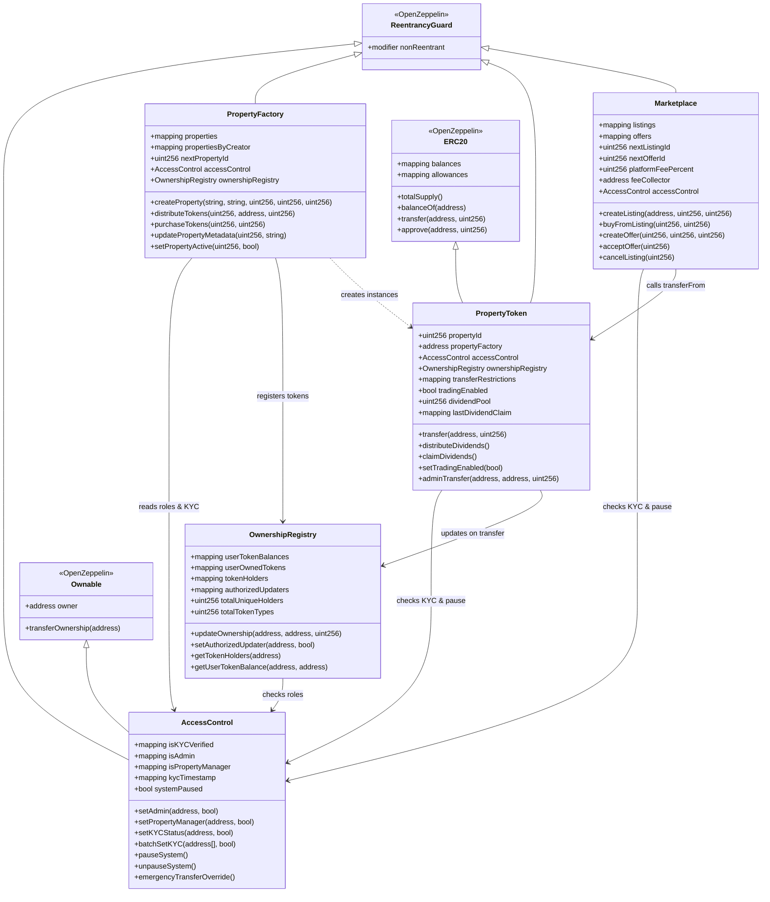
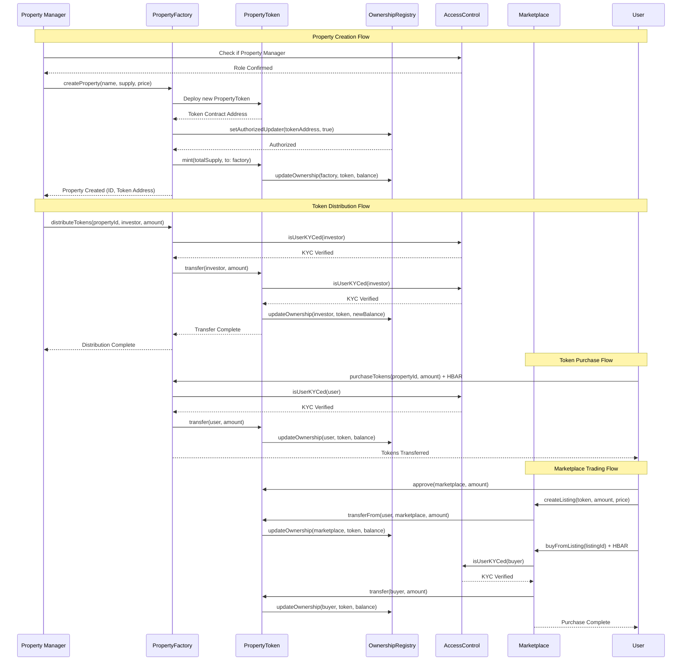
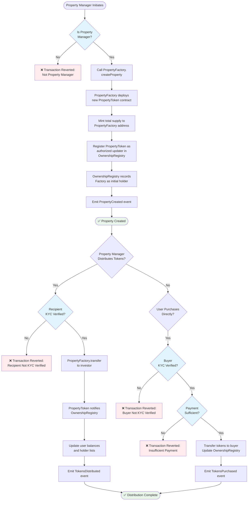
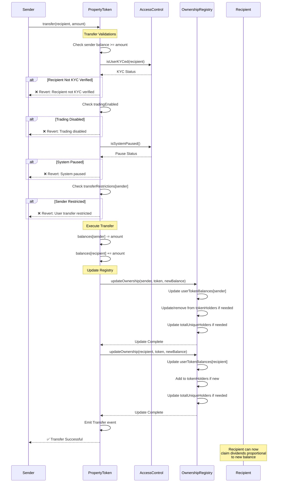
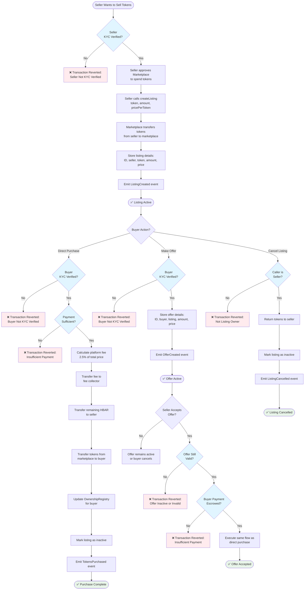
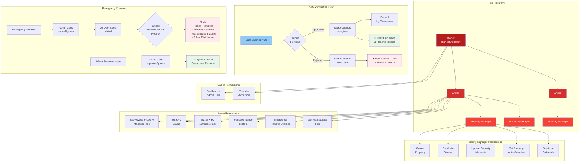
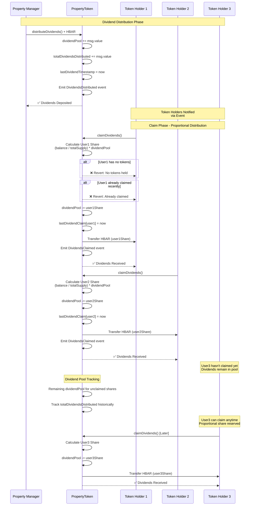

# Smart Contract Architecture - Welcome Home Property Platform

This document provides comprehensive architectural diagrams for the Welcome Home Property tokenization platform smart contracts deployed on Hedera Testnet.

## Table of Contents
1. [Contract Overview & Relationships](#1-contract-overview--relationships)
2. [Contract Interaction Flow](#2-contract-interaction-flow)
3. [Property Creation & Distribution](#3-property-creation--distribution)
4. [Token Transfer Flow](#4-token-transfer-flow)
5. [Marketplace Trading Flow](#5-marketplace-trading-flow)
6. [Access Control & Authorization](#6-access-control--authorization)
7. [Dividend Distribution Flow](#7-dividend-distribution-flow)

---

## 1. Contract Overview & Relationships



**Key Relationships:**
- **AccessControl** is the central authority for roles and KYC verification
- **OwnershipRegistry** tracks token holders across all PropertyToken contracts
- **PropertyFactory** deploys PropertyToken instances and manages properties
- **PropertyToken** is an ERC20 with KYC-gated transfers and dividend features
- **Marketplace** facilitates P2P trading of property tokens

---

## 2. Contract Interaction Flow



---

## 3. Property Creation & Distribution



---

## 4. Token Transfer Flow



---

## 5. Marketplace Trading Flow



---

## 6. Access Control & Authorization



**Authorization Flow for Common Operations:**

| Operation | Required Role | Additional Checks |
|-----------|---------------|-------------------|
| Create Property | Property Manager | System not paused |
| Distribute Tokens | Property Manager | Recipient KYC verified, System not paused |
| Purchase Tokens | Any User | Buyer KYC verified, Sufficient payment, System not paused |
| Transfer Tokens | Token Owner | Recipient KYC verified, Trading enabled, System not paused, Sender not restricted |
| Create Listing | Token Owner | Seller KYC verified, Tokens approved, System not paused |
| Buy from Listing | Any User | Buyer KYC verified, Sufficient payment, System not paused |
| Set KYC Status | Admin | Valid address |
| Pause System | Admin | N/A |
| Distribute Dividends | Property Manager | System not paused |

---

## 7. Dividend Distribution Flow



**Dividend Calculation Example:**

```
Property: 1,000,000 tokens issued
Dividend Deposit: 100 HBAR

Token Holder Balances:
- User1: 300,000 tokens (30%)
- User2: 200,000 tokens (20%)
- User3: 500,000 tokens (50%)

Dividend Shares:
- User1: 100 * 0.30 = 30 HBAR
- User2: 100 * 0.20 = 20 HBAR
- User3: 100 * 0.50 = 50 HBAR

Total: 100 HBAR (distributed proportionally)
```

**Key Features:**
- Dividends are **proportional** to token holdings
- Users **claim** dividends (pull pattern, not push)
- Unclaimed dividends remain in pool
- Tracks last claim timestamp to prevent double claims
- Property manager can distribute multiple times
- Historical tracking via `totalDividendsDistributed`

---

## System Architecture Summary

### Contract Responsibilities

| Contract | Primary Responsibility | Key Pattern |
|----------|------------------------|-------------|
| **AccessControl** | Authorization & Compliance | Role-Based Access Control |
| **OwnershipRegistry** | Cross-Contract Tracking | Authorized Updater Pattern |
| **PropertyFactory** | Property Lifecycle Management | Factory Pattern |
| **PropertyToken** | Token Operations & Dividends | ERC20 + Extensions |
| **Marketplace** | Secondary Trading | Order Book Pattern |

### Security Mechanisms

1. **ReentrancyGuard**: All payable functions protected
2. **Role-Based Access**: Three-tier hierarchy (Owner > Admin > Property Manager)
3. **KYC Gating**: All token transfers require recipient verification
4. **Emergency Pause**: System-wide halt capability
5. **Admin Override**: Emergency transfer capability with event logging
6. **Transfer Restrictions**: Per-user transfer restrictions for compliance
7. **Authorized Updaters**: Registry only accepts updates from verified contracts

### Event Architecture

All state-changing operations emit events for:
- Frontend real-time updates
- Transaction indexing
- Audit trails
- Analytics

Key events:
- `PropertyCreated`, `TokensDistributed`, `TokensPurchased`
- `Transfer` (ERC20), `DividendsDistributed`, `DividendsClaimed`
- `ListingCreated`, `OfferCreated`, `OfferAccepted`
- `KYCStatusUpdated`, `SystemPauseStatusChanged`

### Deployment Information

**Network**: Hedera Testnet (Chain ID: 296)
**RPC**: https://testnet.hashio.io/api
**Explorer**: https://hashscan.io/testnet

**Deployed Contracts**:
- AccessControl: `0xDDAE60c136ea61552c1e6acF3c7Ab8beBd02eF69`
- OwnershipRegistry: `0x4Eb9F441eA43141572BC49a4e8Fdf53f44B5C99C`
- PropertyFactory: `0x366e65Ca8645086478454c89C3616Ba0bAf15A35`
- Marketplace: `0x74347e6046819f6cbc64eb301746c7AaDA614Dec`

**Note**: PropertyToken contracts are deployed dynamically per property by PropertyFactory.

---

## Design Principles

1. **Separation of Concerns**: Each contract has a single, well-defined responsibility
2. **Modularity**: Contracts interact via interfaces, not tight coupling
3. **Upgradability Consideration**: While not upgradeable, architecture supports future proxy patterns
4. **Gas Optimization**: Efficient storage patterns, minimal cross-contract calls
5. **Security First**: Multiple layers of validation and access control
6. **Event-Driven**: Comprehensive event emissions for off-chain indexing
7. **Compliance Ready**: KYC gating and role management for regulatory requirements

---

**Document Version**: 1.0
**Last Updated**: October 31, 2025
**Solidity Version**: 0.8.19
**Framework**: Foundry
